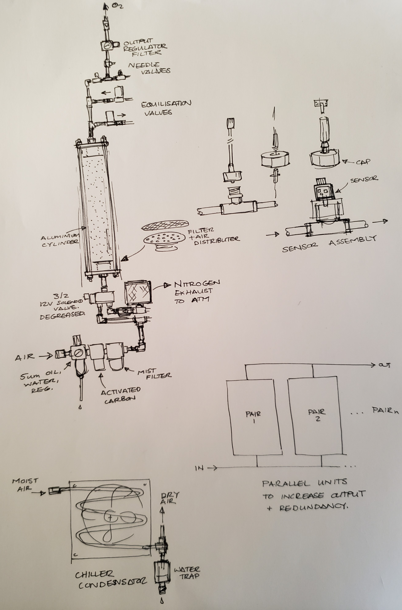
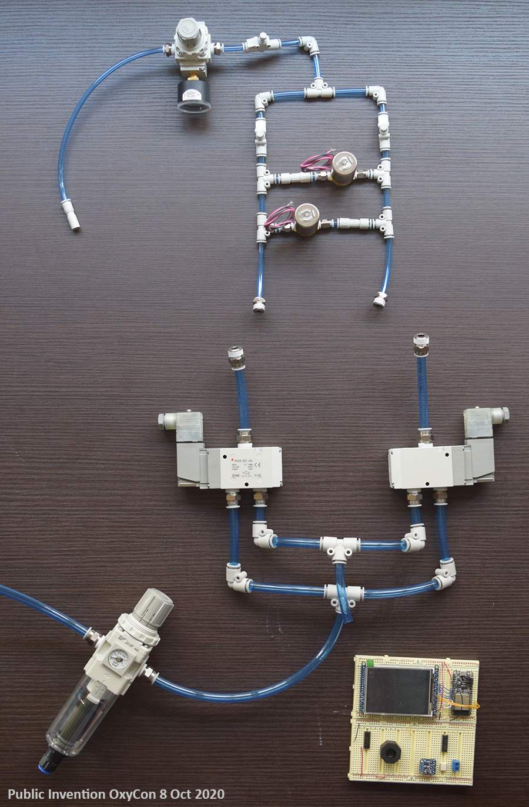

# Design Document
## Public Invention OxyCon

### 1.0 Design Specification

The Public Invention OxyCon aims to meet or exceed the WHO specification for oxygen concentrators [1]. OxyCon is intended for use in remote communities with little access to medical resources and basic infrastructure.

#### 1.1 Functional
1. Deliver medical grade oxygen at 90% O2 concentration or greater at a flow rate of 20LPM or greater.
1. Meets FDA safety regulations for design.
1. Documentation completed sufficiently for a 3rd party to manufacture.
1. Can be manufactured with common engineering tools such as those found in a car mechanics workshop - drill press, lathe etc.
1. Can be made from local resources using local labor.
1. Multi-lingual touch screen interface.
1. Operate in field hospital conditions - hot, humid and/or dusty.
1. Minimum maintenance required - ideally 6+ months between servicing.
1. Tool-less servicing.
1. Uses external air supply of 50-100PSI at 200LPM.
1. Clean, dry and filter the air to provide medical grade air from a standard workshop-type pneumatic ring main.
1. Easy to transport.
1. Sound level less than 40dB at 1m (WHO suggests 60dB).
1. Battery backup power supply for 20 minutes.
1.
#### 1.2 Performance
1. Flow rate shall be +- 5% of the target value.
1. Pressure shall be +- 5% of the target value.
1. Oxygen concentration shall be += 3% of the target value.
1. No more than 70W electrical power is to be consumed per LPM of oxygen delivered.
1. Operational temperature 0-50 degrees Celcius.
1. Operational humidity 0-95% humidity.
#### 1.3 Usability
1. Multi-language UI
1. Graphics display with language agnostic design
#### 1.4 Materials
1. Biocompatability
1. Flammability
1. Standards compliance.
#### 1.5 Electrical
1. 110-240V 50Hz electrical input.
1. Must be able to handle electrical spike up to 480V.
#### 1.6 Manufacturing
1. Can be assembled from components that are sourced and shipped internationally.
1. Large components shall able to be manufactured in a car mechanics workshop or engineering workshop with local skills.
1. Standards compliance.
#### 1.7 Servicing
1. Instructional maintenance process on labels inside device and on interactive walk-through on touch screen
1. Consider Android app to support servicing model
#### 1.8 Documentation
1. Documentation to be completed per Quality Plan.
#### 1.9 Standards
1. Insert relevant standards.
#### 2.0 Regulatory
#### 2.1 Relevant Standards
1. Regulatory requirements

#### 2.2 Failure Mode and Effects Analysis

#### 2.3 Risk Management

### 3.0 Literature Review
#### 3.1 Open Source Projects
- Project Apollo
- Enaccess Open O2
- OxiKit
- Zurich ETH

#### 3.2 Commercial Units

#### 3.3 Processing Methods
##### 3.3.1 Pressure Swing Adsorption

##### 3.3.2 Membrane Filtration

### 4.0 User Needs Research

### 5.0 Concept Design

### 6.0 Prototyping
#### 6.1 Requirements

#### 6.2 First Protoype

### 7.0 Software Architecture
#### 7.1 Overview
RTOS
Timing requirements
Logging
Connectivity
Security
Libraries
### 8.0 Electrical
#### 8.1 Architecture

### References

1. COVID-19 Technical specifications for procurement of oxygen therapy and monitoring devices. 2015. World Health Organization. https://www.who.int/medical_devices/publications/tech_specs_oxygen-concentrators/en/

2. Technical Specifications for Oxygen Concentrators. World Health Organization.

To organise:
https://www.who.int/medical_devices/management_use/mde_tech_spec/en/
