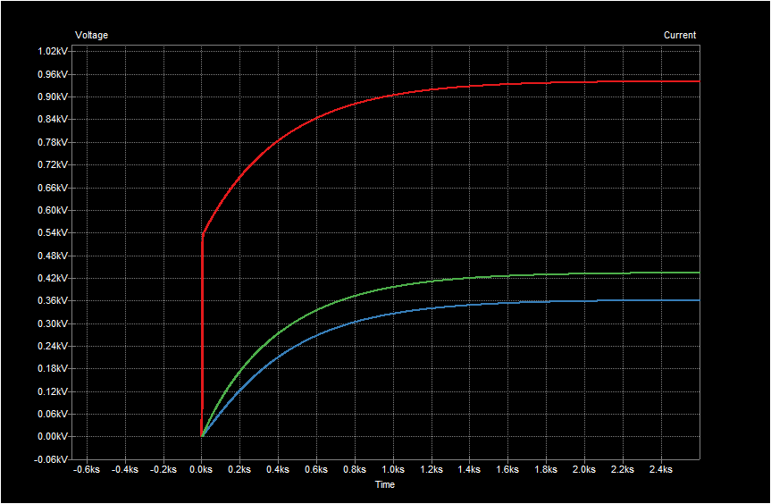

## Ideas for simulating heat capacitance using SPICE

Motivated by ideas such as found at: https://lpsa.swarthmore.edu/Systems/Thermal/SysThermalModel.html#:~:text=To%20model%20this%20system%20with,to%20the%20thermal%20system%20above.  
Lee has made a circuit model using a current source as a heat source and some resistors and capacitors to represent the heat capacitance and possible intercoupeling of a PLANT for the load of the ODECS.

### Schematic Viewer
Stale screen shot of schematic but with circuit blocks outlines.  
  

[Select this link for current schematic ***View on KiCanvas***.](https://kicanvas.org/?github=https%3A%2F%2Fgithub.com%2FPubInv%2FNASA-COG%2Fblob%2Fdevelop%2Fexperimentation%2FKiCadThermo%2FRCRC%2FRCRC%2FRCRC.kicad_sch)  
Unfortunatly the KiCanvase view does not show the dashed outlines around circuit blocks.

**Notes**  
* The resistors have units DegreeC/Watt   
* The thermo capicatance should be in J/kg-K and should be Farad, however for the schematic capacitors are in uF and we have to enter as very large numbers of uF.  
* The current source are Watts.  
* The V out is actualy Degrees C.  

### Simulation results

### Limitations / Errors in Approximations

This simulation does not represent air flow. It is as if only thermoconducation through a solid was responsible for all heat flow.
