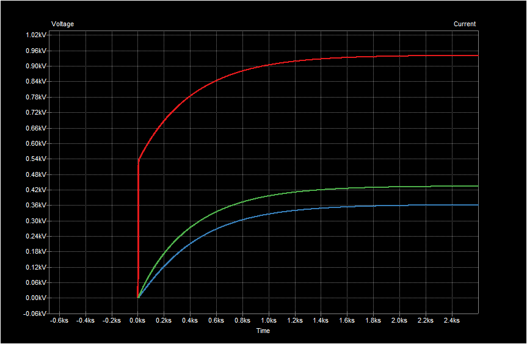

## Ideas for simulating heat capacitance using SPICE

Modivated by ideas such as found at: https://lpsa.swarthmore.edu/Systems/Thermal/SysThermalModel.html#:~:text=To%20model%20this%20system%20with,to%20the%20thermal%20system%20above.

I have made a circuit model using a current source as a heat source and some resistors and capacitors to represent the heat capacitance and possible intercoupeling of a PLANT for the load of the ODECS.

### Sechematic

### Simulation results

