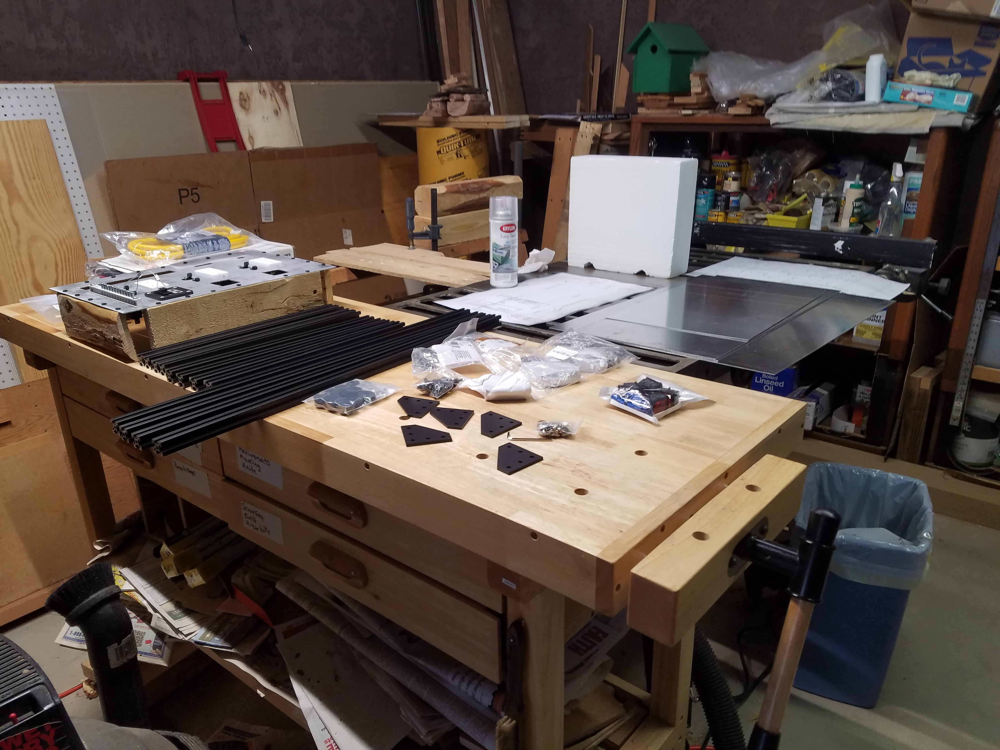
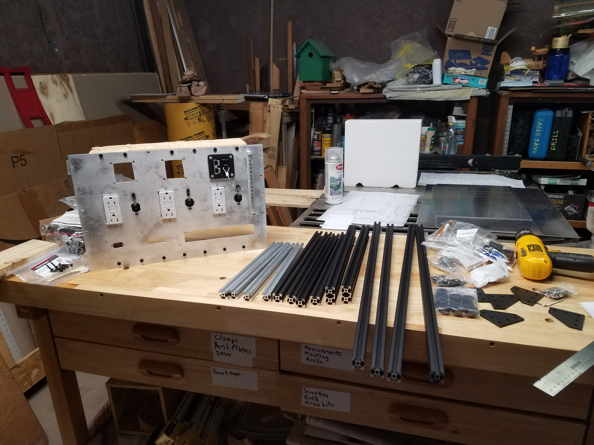
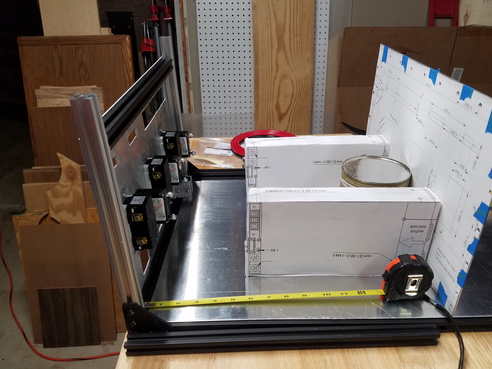
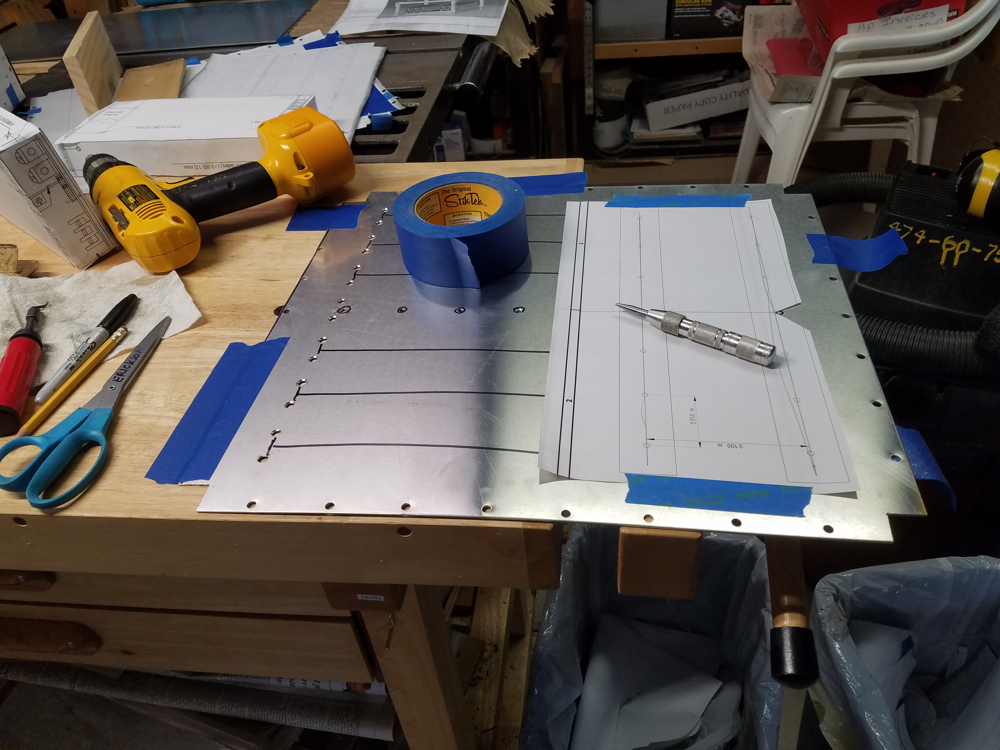
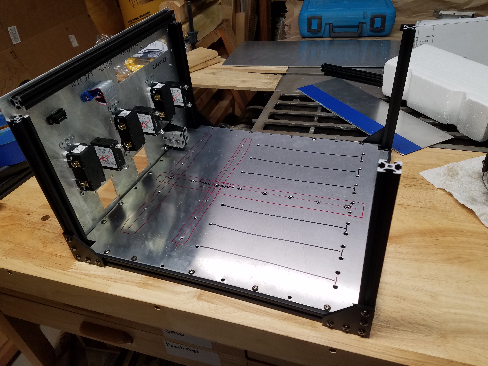
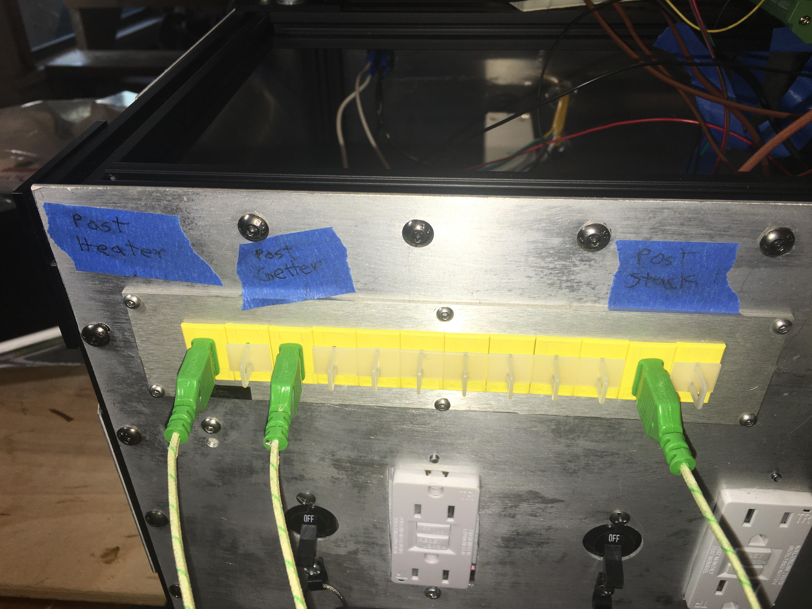
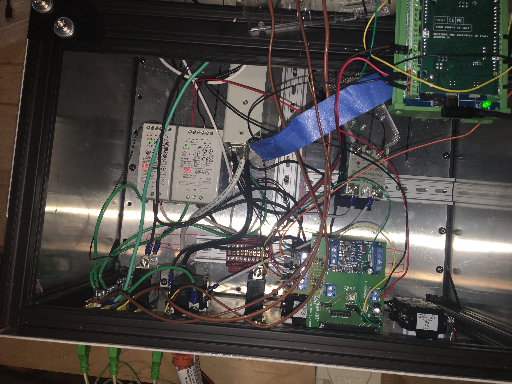

## File Descriptions / Quick View
Memories of how this was assembled in March 2023

   
Front panel was assembled with components first.  
Other parts staged for start of assembly.  

 

Parts staged for start of assembly

 

During efforts to decide the length of the cabnet.  
The bottom panel long dimension was set to 463mm. 

  
Prepairing to center punch the front DIN rail holes

  
After punching DIN rail holes.  Red outlines the proposed approximat location of the DIN rails.

Detail of the thermocouple jack panel.

Overhead view of OEDCS1-Aug-17.JPG

### Videos made during assembly

[20230405_164525.mp4](20230405_164525.mp4)

[20230405_165244.mp4](20230405_165244.mp4)

[20230405_165423.mp4](20230405_165423.mp4)

[20230405_224931.mp4](20230405_224931.mp4)

[20230407_164746.mp4](20230407_164746.mp4)
