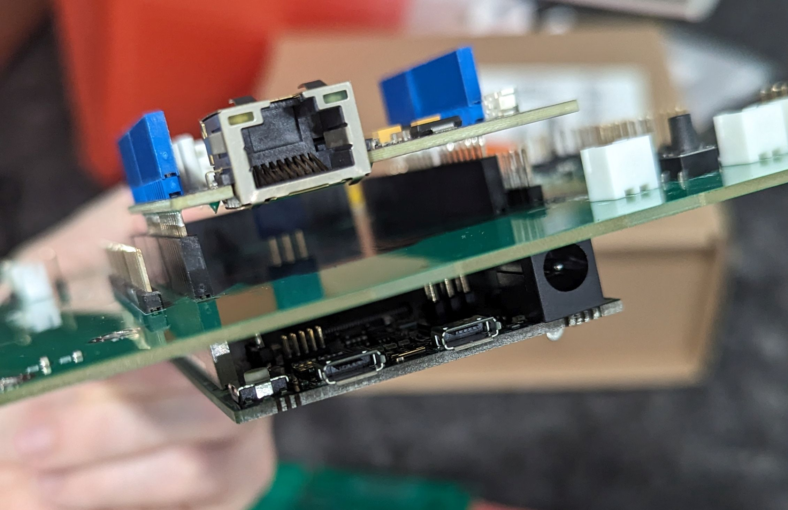

# Serial Number 2 OEDCS Enclosure
Information capturing the build of Serial_number2 OEDCS 

## Details

## Second Enclosure Fabrication Notes and Photos
### CAD drawings. 
Isometric view of FreeCad assembly drawing showing the Ethernet, Controller V1 and Due assembly off to the side.
> 

Serial number 2, Assembly on 20230914

### Parts
Enclosure 2 parts and assembly stuff  
> 

Front and bottom panels  
> 

Bottom and rear panel  
> 

### Some deviations of note during assembly
We had to......
Lawrence made modifications to the DXF files for rear panel holes
and may include the following
> On 08/14/2023 5:56 PM EDT Lawrence Kincheloe <lokimail@gmail.com> wrote:
> I would also like to add a USB and Ethernet jack to the back as well.
> Both require a 30 mm hole. 
> https://www.adafruit.com/product/4212
> https://www.adafruit.com/product/4130
> Something missing from this diagram is cutouts for the fans for the power supplies and SSR. These WILL need active cooling and we will need to account for air flow from the back to the side panels 

## Parts List (Partial)
*stuff here in a table*

### Other:
This does not include the ...

### Wiring of Assemblies In Enclosure

*stuff here such as the asembly of the DUE, Controller V1, and Ethernet cards*
The Due and ethernet cards mount with the Controler V1 card something like this:
Perspective view showing the ethernet card above the Controler V1 card  
>   

Top view showing the ethernet card above the Controler V1 card  
>   

Bottom view showing the Due card above the Controler V1 card  
> 

Side view showing the ethernet card above the Controler V1 card and the Due below
> 

Actual Control v1 with Ethernet and Due  
<a
href="Boards20230828/Due_Controller_Ethernet.jpg">   
***Due_Controller_Ethernet.jpg***
</a>

Controller thermocouple wiring detail  
<a
href="https://user-images.githubusercontent.com/5054116/268123079-14d45110-6290-4cd9-9399-6f682203b03e.jpg">   
***Thermocouple wiring detail***
</a>

### Cautions
None.

